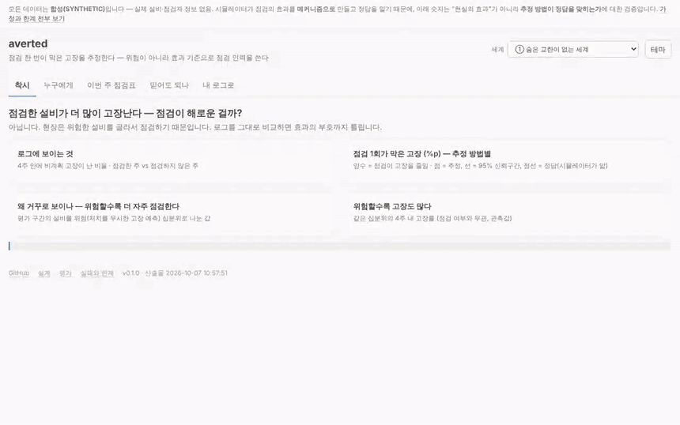
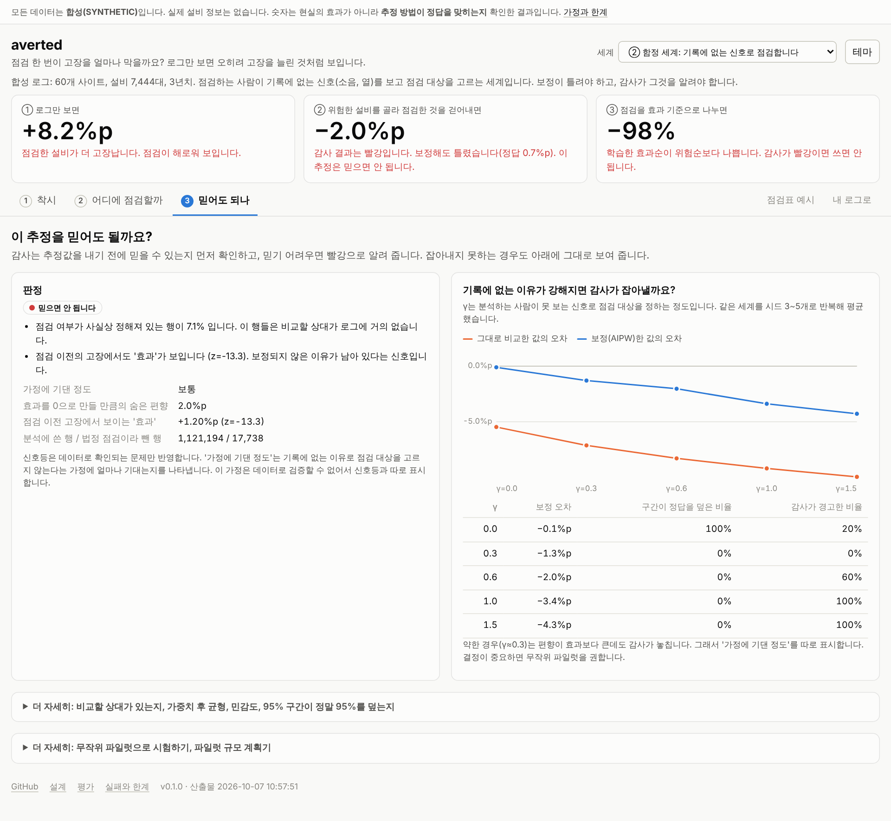

# averted

**점검을 더 하면 고장이 줄까요? 로그만 보면 거꾸로 나옵니다.**

점검한 설비가 점검하지 않은 설비보다 더 고장나 보입니다. 현장이 위험한 설비를 골라서 점검하기 때문입니다.
이 저장소는 그 착시를 걷어내고, **점검 한 번이 막은 고장**을 추정합니다.
그리고 한정된 점검 인력을 위험이 아니라 **효과**가 큰 설비에 먼저 씁니다.
추정을 **언제 믿으면 안 되는지**도 함께 알려 줍니다.

**라이브 데모**: <https://sokldjs554.github.io/averted/> (서버 없이 열리는 데모입니다)



> 모든 데이터는 **합성(SYNTHETIC)** 입니다. 점검의 효과를 직접 만든 시뮬레이터가 정답을 알고 있습니다. 그래서 아래 숫자는 현실의 효과가 아니라, **추정 방법이 정답을 맞히는지** 확인한 결과입니다.

## 한눈에 보기

1. **로그만 보면** 점검한 설비의 4주 내 고장률이 <!-- num:scenarios.base.audit.data.outcome_rate_treated|.0% -->12%<!-- /num -->, 점검하지 않은 설비는 <!-- num:scenarios.base.audit.data.outcome_rate_control|.0% -->7%<!-- /num -->입니다. 점검이 해로워 보입니다.
2. **위험한 설비를 골라 점검한 영향을 걷어내면** 점검이 오히려 고장을 막습니다. 점검 100번에 고장 약 <!-- num:summary.base.aipw_averted|pp -->0.7<!-- /num -->건을 막는 것으로 추정되고, 시뮬레이터가 아는 정답은 <!-- num:summary.base.truth_averted|pp -->0.8<!-- /num -->건입니다.
3. **그래서** 같은 점검 횟수로 위험한 순서보다 효과가 큰 순서로 점검하면, 고장을 <!-- num:summary.base.lift_resp_vs_risk|.0% -->30%<!-- /num --> 더 막습니다.

## 틀리는 경우도 보여 줍니다

이 프로젝트가 내세우는 것은 "맞는다"보다 **"언제 틀리는지 안다"** 입니다. 데모 위쪽의 세계 선택에서 ②를 고르면 직접 볼 수 있습니다.

- **점검하는 사람이 기록에 없는 신호(소음, 열 같은 현장 감각)로 점검 대상을 고르면, 보정해도 틀립니다.** 실제로는 점검이 고장을 막는데(정답 <!-- num:summary.hunch.truth_averted|pp -->0.7<!-- /num -->건), 추정은 반대로 고장을 늘린다(<!-- num:summary.hunch.aipw_averted|pp -->-2.0<!-- /num -->건)고 나옵니다. 로그 감사가 이것을 **빨강**으로 알립니다. 다만 약한 경우는 놓칩니다. 자세한 내용은 [docs/failures.md](docs/failures.md)에 있습니다.
- **감사가 빨강이면 학습한 정책을 쓰면 안 됩니다.** 오염된 신호로 배운 효과순은 무작위보다도 나쁩니다.
- **위험한 순서로 충분한 세계도 있습니다.** 설비마다 점검 효과가 같다면 두 순서의 차이가 없습니다. 이 도구는 그것도 알려 줍니다.
- **고객사 데이터가 적으면 배우지 못합니다.** 학습에 쓴 사이트가 적으면 단순한 규칙(수리가 접수된 설비는 제외)이 더 낫습니다.



## 직접 만든 것

| 무엇 | 어디 | 맞는지 어떻게 확인했나 |
|---|---|---|
| 점검한 세계와 안 한 세계를 같은 조건으로 돌려 정답을 만드는 시뮬레이터 | `sim/` | 직접 돌려 센 결과와 같은지 테스트 |
| 점검 효과 추정기 (AIPW) | `causal/estimators.py` | 정답을 되찾는지, 널리 쓰는 라이브러리(econml)와 결과가 같은지 테스트. 95% 구간이 정답을 덮은 비율은 <!-- num:summary.coverage.base.aipw|.0% -->95%<!-- /num --> |
| 설비마다 다른 효과를 배우는 모형 (반응도 모형, DragonNet) | `causal/` | 같은 기준(점검 100번당 막는 고장)으로 단순한 규칙과 비교 |
| 로그 감사: 이 로그로 추정해도 되는지 먼저 검사 | `audit.py` | 기록에 없는 신호의 강도를 바꿔 가며 경고가 울리는 비율을 측정 |
| 무작위 파일럿 계획기: 몇 대를 몇 주 시험해야 하는지 계산 | `causal/pilot.py`와 브라우저용 포트 | 파이썬과 JS가 같은 값을 내는지 테스트 |

AIPW는 "점검할 확률 모형"과 "고장 모형" 중 하나만 맞아도 결과가 맞는 방법입니다.
내 로그로 돌리려면 CSV 한 장을 `POST /v1/audit`에 올리면 됩니다. 방법은 [실제 로그에 적용하기](docs/real-data.md)에 있습니다.

## 실행

```bash
make install     # 개발용 패키지 설치
make test        # 테스트
make serve       # http://localhost:8000/console/  (실험 결과는 artifacts/ 에 들어 있습니다)
docker compose up --build
```

## 문서

[설계](docs/design.md) · [시뮬레이터](docs/simulator.md) · [평가](docs/evaluation.md) · **[실패와 한계](docs/failures.md)** · [실제 로그에 적용하기](docs/real-data.md) · [선행 연구](docs/prior-work.md) · [만든 방식과 AI 사용 공개](docs/how-this-was-built.md)

## 채용 공고의 기술이 어디에 있나

| 공고 | 저장소 |
|---|---|
| Python 데이터 전처리·분석 (Pandas, NumPy) | `sim/` 생성기, `causal/data.py` (`LogSpec`으로 실제 로그의 열을 맞춥니다) |
| 회귀·분류 | 점검 확률(분류), 고장 확률(분류), 반응도(최소제곱) |
| 딥러닝 설계·성능 개선 (PyTorch) | `causal/dragonnet.py`. 트리·규칙과 같은 기준으로 비교하고 한계도 공개합니다 |
| 분석 결과를 API/웹으로 (FastAPI) | `api/` (결과 조회, 감사 업로드, 파일럿 계획기), `console/` |
| 데이터 시각화 | 신뢰구간, 산점도, 정책 비교 (색약 고려 팔레트, 표 보기, 다크 모드) |
| 클라우드 (AWS, GCP) | `Dockerfile`, `deploy/gcp`, `deploy/aws` |
| 실제 서비스 운영 | `/health`, `/metrics`, 업로드 한도, CI(린트, 테스트, 숫자 일치, 이미지 빌드) |
| 실증 프로젝트, 고객 맞춤형 모델 | 고객 로그에 먼저 돌리는 감사, 파일럿 계획기, 고객사 데이터를 모을수록 나아지는 정도 |

## 범위

- 실제 데이터는 없습니다.
- 효과의 크기는 시뮬레이터의 가정이며 현실의 값이 아닙니다.
- 콘솔은 인증이 없는 데모입니다.
- 점검 주기를 바꾸는 것 같은 프로그램 전체의 효과는 추정하지 않습니다.
